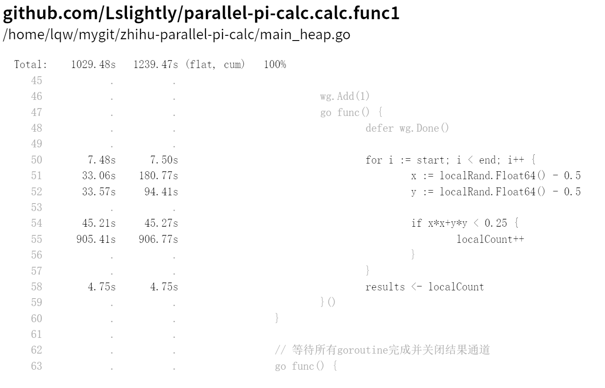
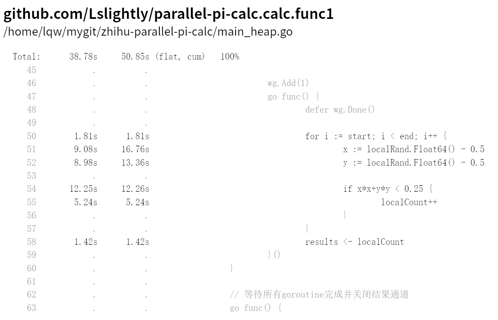
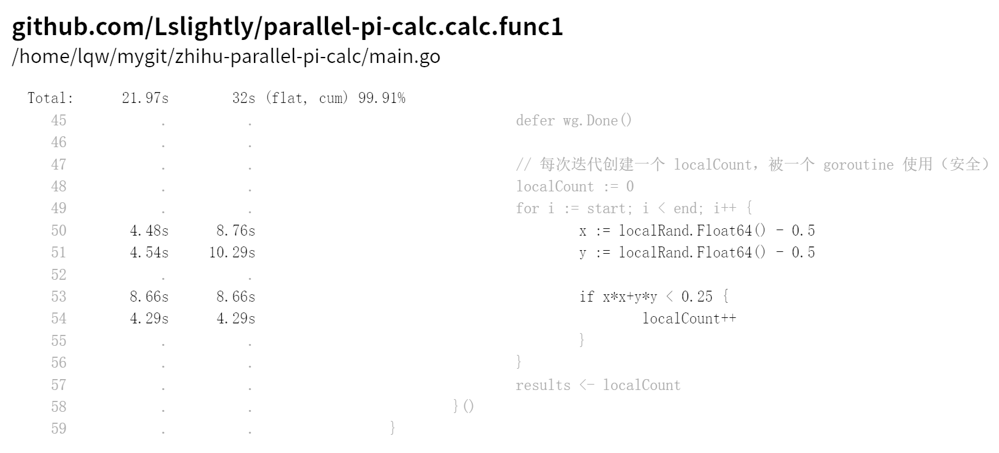
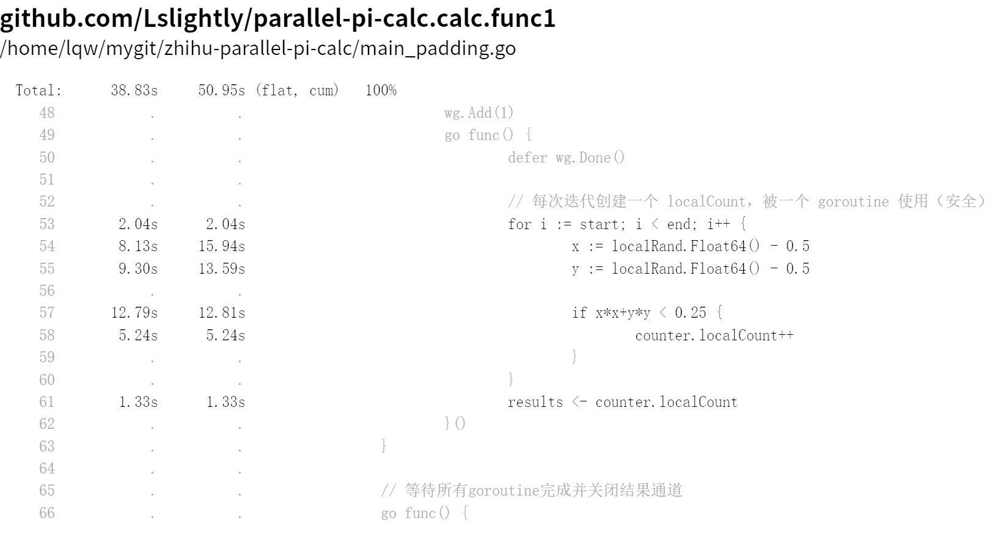

[zhiqu question](https://www.zhihu.com/question/1983394937543366516)

## 配置和脚本

配置:
- base 逃逸，堆分配 (tags heap)
- base_padding 堆分配但是有padding (tags padding)
- opt 栈分配

[`build.sh`](./build.sh) 分 tags 构建:
- heap tag为堆分配版本(base)
- padding tag为堆分配+padding版本
- 无tag为栈分配版本(opt)

benchmark配置:
- `BenchmarkCalc`，多核
- `BenchmarkCalcSingleCore`，单核，不会有false sharing的问题。用于测试堆分配访存和栈分配访存区别

[`pprof.sh`](./pprof.sh)，开pprof web界面，端口对应关系:

| 核数 | 堆分配(base) | 栈分配(opt) | 堆分配且有padding(base_padding) |
| ---- | ------------ | ----------- | ------------------------------- |
| 20   | 18121        | 18122       | 18123                           |
| 1    | 18124        | 18125       | 18126                           |

## calc.func1函数行级性能








### `localCount`访存延迟([flat](https://github.com/google/pprof/blob/main/doc/README.md#details))

| 核数 | 堆分配(base) | 栈分配(opt) | 堆分配且有padding(base_padding) |
| ---- | ------------ | ----------- | ------------------------------- |
| 20   | 905.41s      | 15.38s      | 18.03s                          |
| 1    | 5.24s        | 4.29s       | 5.24s                           |

核数多了之后false sharing就明显了。

> 本来想用perf c2c看false sharing情况，但是要重启服务器，用的人太多，就算了。

此外在多核上opt也比base_padding少3秒，一方面是cache miss，另一方面则是指令上的区别。从单核来说，少的这1秒可能就是 `INCQ 0(BX)` 和 `LEAQ 0x1(CX), DX` 的区别了。

`localCount++` 的base_padding plan9汇编

```
    counter.localCount++
  0x493d72		488b5c2450		MOVQ 0x50(SP), BX	
  0x493d77		48ff03			INCQ 0(BX)		
```

opt plan9汇编

```
    localCount++
  0x493d03		488b4c2420		MOVQ 0x20(SP), CX	
  0x493d08		488d5101		LEAQ 0x1(CX), DX	
```

### 其他行时间占比

除了`localCount`在base和base_padding配置下有更长的时间外，`x := localRand.Float64() - 0.5` 和 `if x*x+y*y < 0.25 {` 甚至也需要更长的时间。

从[cum](https://github.com/google/pprof/blob/main/doc/README.md#details)指标来看 `x := localRand.Float64() - 0.5`的耗时如下:

| 核数 | 堆分配(base) | 栈分配(opt) | 堆分配且有padding(base_padding) |
| ---- | ------------ | ----------- | ------------------------------- |
| 20   | 180.77s      | 31.75s      | 58.18s                          |
| 1    | 16.76s        | 8.76s       | 15.94s                           |

看起来多核下base相比于base_padding也差3倍。但奇怪的是 opt 和 base_padding 还是有差别。可能的一种解释是 `localCount` 栈分配之后，需要加载的缓存就只有栈区和 `localRand` 所在的cache line，不需要加载 `localCount` 堆分配所在的缓存行，从而使得 `localRand` 函数调用时的缓存冲突减少了。

